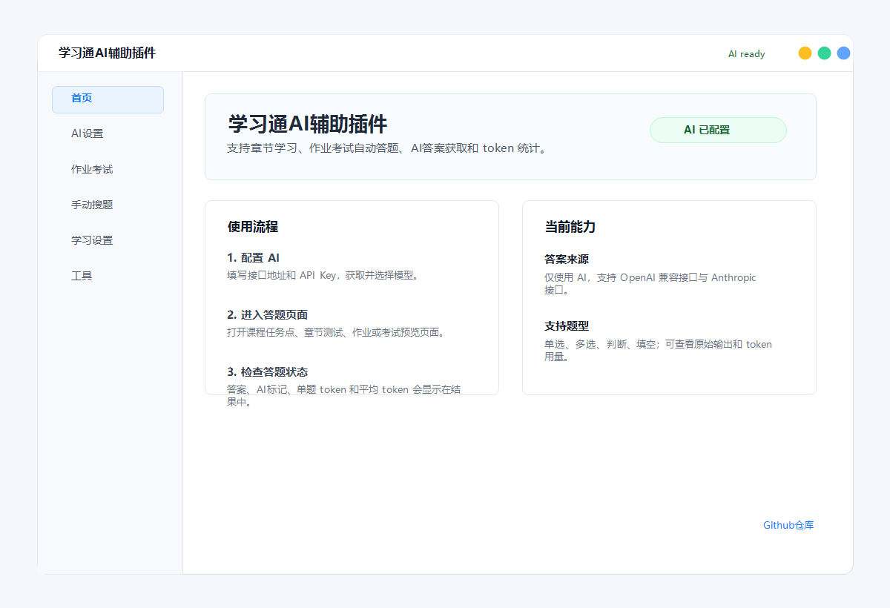
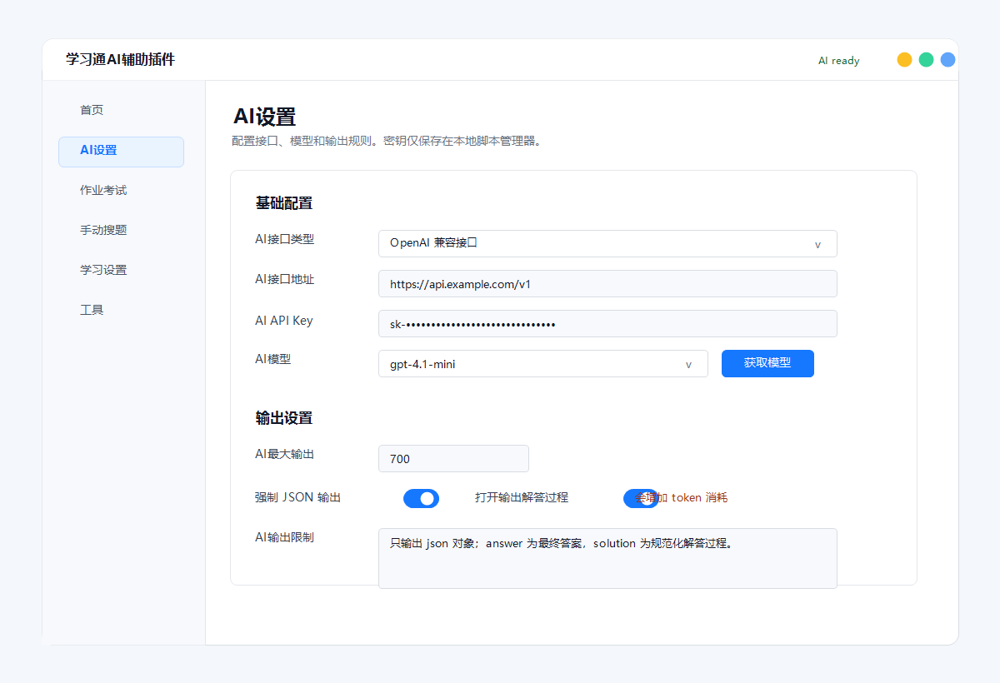
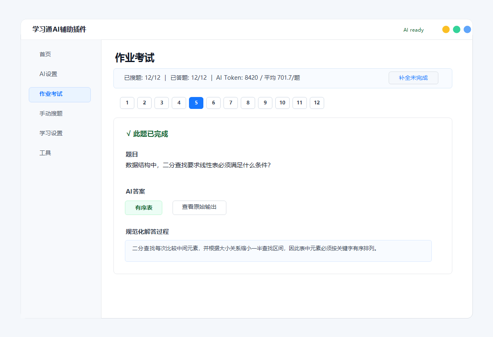
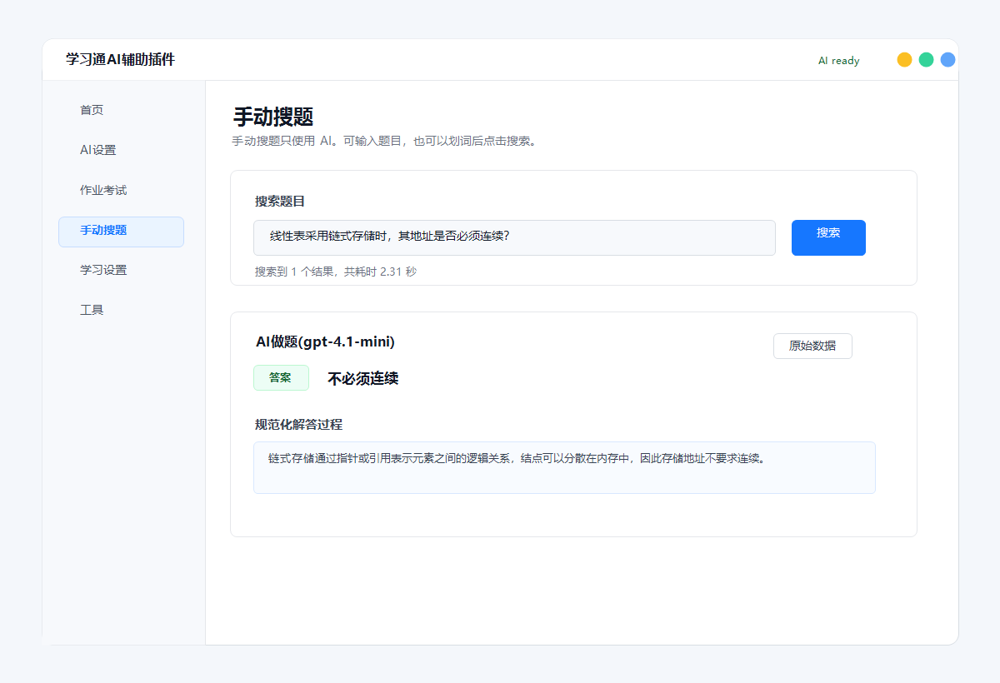

# 学习通AI辅助插件

学习通 AI 辅助插件是一个油猴/脚本猫用户脚本，面向学习通页面，支持自定义 AI 接口、自动答题、手动搜题和章节学习辅助。

[](https://github.com/yxxawa/xuexitong-ai-helper/releases)
[](./LICENSE)

## 界面预览



| AI 设置 | 作业考试 |
| --- | --- |
|  |  |

| 手动搜题 |
| --- |
|  |

## 主要功能

- AI 设置：支持 OpenAI 兼容接口、Anthropic 接口、模型列表获取、温度、最大输出和 JSON 输出限制。
- 作业考试：支持单选、多选、判断、填空等题型，题目图片会以 base64 方式传给支持视觉的模型。
- 手动搜题：输入题目或划词后调用 AI 搜索，并展示答案与原始输出。
- 结果查看：作业/考试页面可查看每题题目、AI 答案、原始输出、请求/响应和 token 用量。
- 学习设置：保留学习通章节学习相关设置。

## 安装使用

1. 安装 Tampermonkey、Violentmonkey 或脚本猫。
2. 从 [Releases](https://github.com/yxxawa/xuexitong-ai-helper/releases) 下载 `xuexitong-ai-helper.common.user.js`，导入脚本管理器。
3. 打开学习通页面，在悬浮窗口的“AI设置”中填写接口地址、API Key 和模型。
4. 进入作业、考试或章节测试页面后使用自动答题；也可以在“手动搜题”中单独调用 AI。

## 开发构建

需要 Node.js 和 pnpm。

```bash
pnpm install
pnpm build
```

常用命令：

```bash
pnpm typecheck
pnpm dev
```

构建产物默认输出到 `dist/`：

- `xuexitong-ai-helper.user.js`
- `xuexitong-ai-helper.dev.user.js`
- `xuexitong-ai-helper.common.user.js`

## 仓库结构

- `packages/core`：工作器、题目处理、通用工具。
- `packages/scripts`：学习通适配、页面 UI、AI 配置和答题逻辑。
- `packages/utils`：用户脚本生成工具。
- `vendor/easy-us`：随仓库保留的补丁版 UI 依赖，用于保持当前悬浮窗口行为。
- `scripts`：本地开发和构建脚本。

## 注意

本项目仅用于学习、研究和技术交流。使用时请遵守学校、课程和平台规则。AI 输出可能存在错误，提交前应自行核对结果。

## 致谢

本项目基于 OCS 和 easy-us 修改整理，遵循 MIT License。详细说明见 `NOTICE.md` 和 `LICENSE`。
